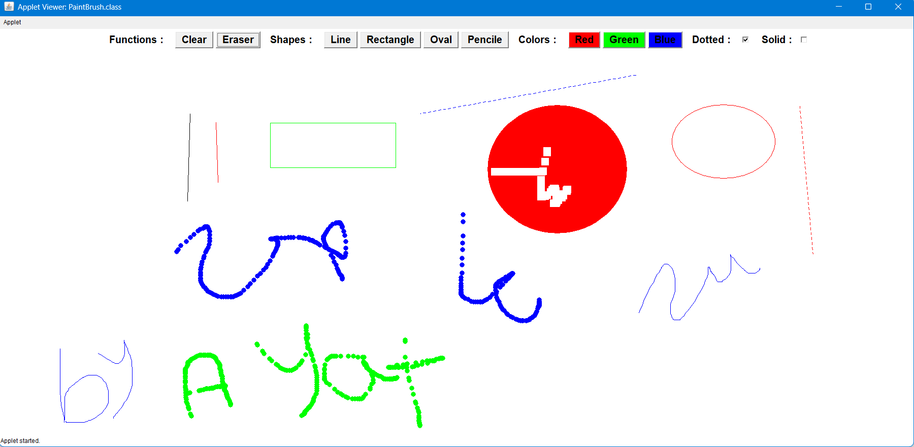

# Paint Brush Project 🎨

## Overview  
**Paint Brush** is a Java-based applet application that allows users to draw and edit basic shapes with customizable colors, line strokes, and additional features like eraser.
The project demonstrates the principles of Object-Oriented Programming (OOP) through its design and implementation.



---

## Features  
- **Drawing Tools**:  
  - Rectangle, Oval, and Line (with real-time preview while dragging).  
  - Freehand drawing for doodles.  
  - Eraser for removing specific parts of the drawing.  
- **Customization Options**:  
  - Choose colors (Red, Green, Blue) for shapes and drawings.  
  - Option to draw filled or outlined shapes.  
  - Dotted or solid line strokes for shapes.  
- **Editing Tools**:  
  - Clear all drawings with a single button.  

---

## How to Use  
1. **Select a Tool**:  
   Choose a shape, freehand, or eraser tool from the buttons.  
2. **Customize Your Drawing**:  
   - Pick a color.  
   - Enable or disable options like filled shapes or dotted strokes.  
3. **Draw**:  
   Drag the mouse to create shapes or draw freely.  
4. **Edit**:  
   Use the eraser your drawing.  
5. **Clear**:  
   Click "Clear All" to reset the drawing area.  

---

## Requirements  
- Java Development Kit (JDK) 8 or higher.  
- A Java-compatible IDE or a browser that supports Java applets.

---

## How to Run  
1. Compile the `.java` files using:  
   ```bash
   
   javac PaintBrush.java

2. Run the Applet using:
   ```bash
   
   appletviewer PaintBrush.html
 
